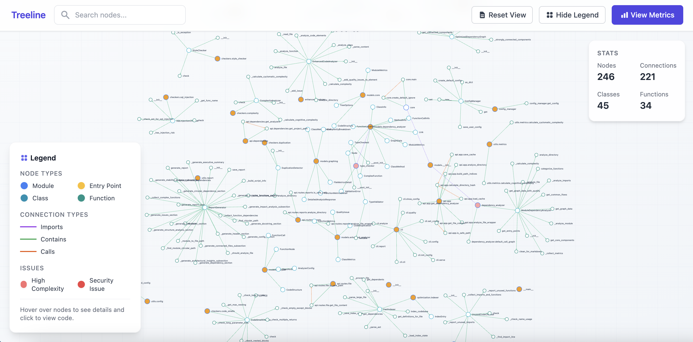

# Web Interface

Treeline’s web interface provides an interactive way to visualize your Python codebase. It is served by the FastAPI backend and requires no separate installation.



## Starting the Web Interface

Run the following command:
```bash
treeline serve
```

## Features

* Graph Visualization: Displays modules, classes, and functions as nodes, with edges representing dependencies (imports, contains, calls).
* Node Details: Click nodes to view metrics (e.g., complexity, lines) and quality issues (e.g., code smells, security risks).
* Search: Filter nodes by name using the search bar.
* Zoom and Pan: Navigate large graphs with ease.
* Legend: Color-coded guide for node types and edge relationships.


## Notes

The frontend is pre-bundled and served automatically when you run treeline serve. No Node.js or frontend setup is required on your end.