# Project Analysis Report

[Open Interactive Code Visualization](./code_visualization.html)

## Code Structure Visualization

The following diagrams show the project structure from different perspectives:


### Module Dependencies

Overview of how modules are connected:


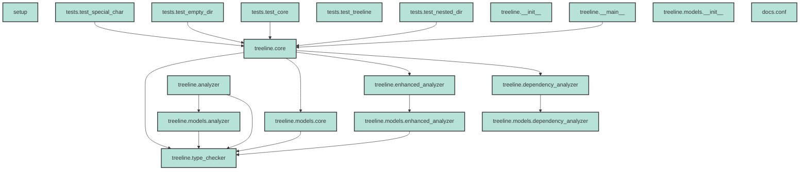

### treeline.__init__

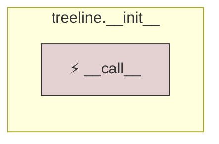

### treeline.__main__


### treeline.analyzer

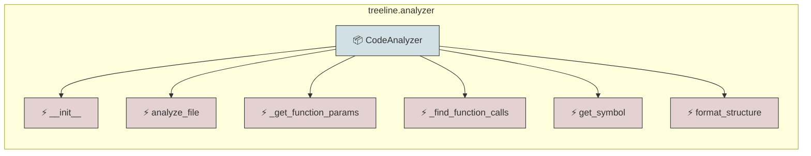

### treeline.core

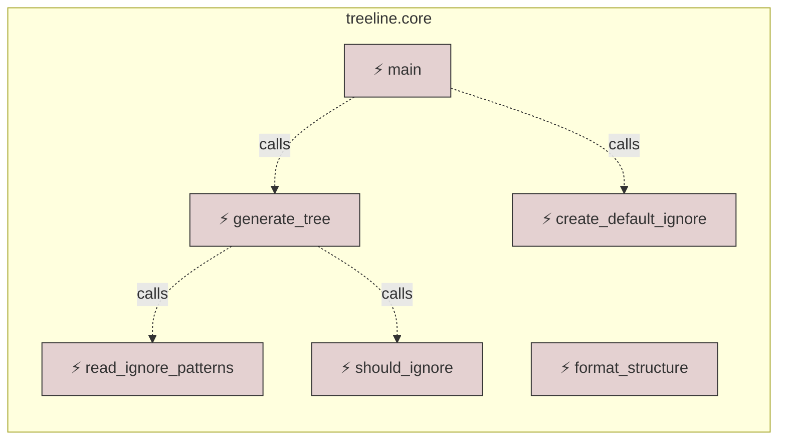

### treeline.dependency_analyzer

```mermaid
graph TD

    %% Styling
    classDef fnNode fill:#e4d1d1,stroke:#333
    classDef clsNode fill:#d1e0e4,stroke:#333

    subgraph treeline_dependency_analyzer["treeline.dependency_analyzer"]
        direction TB
        treeline_dependency_analyzer_ModuleDependencyAnalyzer["📦 ModuleDependencyAnalyzer"]:::clsNode
        treeline_dependency_analyzer_ModuleDependencyAnalyzer___init__["⚡ __init__"]:::fnNode
        treeline_dependency_analyzer_ModuleDependencyAnalyzer --> treeline_dependency_analyzer_ModuleDependencyAnalyzer___init__
        treeline_dependency_analyzer_ModuleDependencyAnalyzer_analyze_directory["⚡ analyze_directory"]:::fnNode
        treeline_dependency_analyzer_ModuleDependencyAnalyzer --> treeline_dependency_analyzer_ModuleDependencyAnalyzer_analyze_directory
        treeline_dependency_analyzer_ModuleDependencyAnalyzer__analyze_module["⚡ _analyze_module"]:::fnNode
        treeline_dependency_analyzer_ModuleDependencyAnalyzer --> treeline_dependency_analyzer_ModuleDependencyAnalyzer__analyze_module
        treeline_dependency_analyzer_ModuleDependencyAnalyzer__analyze_imports["⚡ _analyze_imports"]:::fnNode
        treeline_dependency_analyzer_ModuleDependencyAnalyzer --> treeline_dependency_analyzer_ModuleDependencyAnalyzer__analyze_imports
        treeline_dependency_analyzer_ModuleDependencyAnalyzer__collect_metrics["⚡ _collect_metrics"]:::fnNode
        treeline_dependency_analyzer_ModuleDependencyAnalyzer --> treeline_dependency_analyzer_ModuleDependencyAnalyzer__collect_metrics
        treeline_dependency_analyzer_ModuleDependencyAnalyzer__calculate_complexity["⚡ _calculate_complexity"]:::fnNode
        treeline_dependency_analyzer_ModuleDependencyAnalyzer --> treeline_dependency_analyzer_ModuleDependencyAnalyzer__calculate_complexity
        treeline_dependency_analyzer_ModuleDependencyAnalyzer_generate_module_overview_diagram["⚡ generate_module_overview_diagram"]:::fnNode
        treeline_dependency_analyzer_ModuleDependencyAnalyzer --> treeline_dependency_analyzer_ModuleDependencyAnalyzer_generate_module_overview_diagram
        treeline_dependency_analyzer_ModuleDependencyAnalyzer_generate_module_detail_diagram["⚡ generate_module_detail_diagram"]:::fnNode
        treeline_dependency_analyzer_ModuleDependencyAnalyzer --> treeline_dependency_analyzer_ModuleDependencyAnalyzer_generate_module_detail_diagram
        treeline_dependency_analyzer_ModuleDependencyAnalyzer_generate_mermaid_graphs["⚡ generate_mermaid_graphs"]:::fnNode
        treeline_dependency_analyzer_ModuleDependencyAnalyzer --> treeline_dependency_analyzer_ModuleDependencyAnalyzer_generate_mermaid_graphs
        treeline_dependency_analyzer_ModuleDependencyAnalyzer_generate_html_visualization["⚡ generate_html_visualization"]:::fnNode
        treeline_dependency_analyzer_ModuleDependencyAnalyzer --> treeline_dependency_analyzer_ModuleDependencyAnalyzer_generate_html_visualization
        treeline_dependency_analyzer_ModuleDependencyAnalyzer_clean_for_markdown["⚡ clean_for_markdown"]:::fnNode
        treeline_dependency_analyzer_ModuleDependencyAnalyzer --> treeline_dependency_analyzer_ModuleDependencyAnalyzer_clean_for_markdown
        treeline_dependency_analyzer_ModuleDependencyAnalyzer_generate_reports["⚡ generate_reports"]:::fnNode
        treeline_dependency_analyzer_ModuleDependencyAnalyzer --> treeline_dependency_analyzer_ModuleDependencyAnalyzer_generate_reports
    end

```

### treeline.enhanced_analyzer

```mermaid
graph TD

    %% Styling
    classDef fnNode fill:#e4d1d1,stroke:#333
    classDef clsNode fill:#d1e0e4,stroke:#333

    subgraph treeline_enhanced_analyzer["treeline.enhanced_analyzer"]
        direction TB
        treeline_enhanced_analyzer_EnhancedCodeAnalyzer["📦 EnhancedCodeAnalyzer"]:::clsNode
        treeline_enhanced_analyzer_EnhancedCodeAnalyzer___init__["⚡ __init__"]:::fnNode
        treeline_enhanced_analyzer_EnhancedCodeAnalyzer --> treeline_enhanced_analyzer_EnhancedCodeAnalyzer___init__
        treeline_enhanced_analyzer_EnhancedCodeAnalyzer_analyze_file["⚡ analyze_file"]:::fnNode
        treeline_enhanced_analyzer_EnhancedCodeAnalyzer --> treeline_enhanced_analyzer_EnhancedCodeAnalyzer_analyze_file
        treeline_enhanced_analyzer_EnhancedCodeAnalyzer__calculate_maintainability_index["⚡ _calculate_maintainability_index"]:::fnNode
        treeline_enhanced_analyzer_EnhancedCodeAnalyzer --> treeline_enhanced_analyzer_EnhancedCodeAnalyzer__calculate_maintainability_index
        treeline_enhanced_analyzer_EnhancedCodeAnalyzer__calculate_cognitive_load["⚡ _calculate_cognitive_load"]:::fnNode
        treeline_enhanced_analyzer_EnhancedCodeAnalyzer --> treeline_enhanced_analyzer_EnhancedCodeAnalyzer__calculate_cognitive_load
        treeline_enhanced_analyzer_EnhancedCodeAnalyzer__check_function_metrics["⚡ _check_function_metrics"]:::fnNode
        treeline_enhanced_analyzer_EnhancedCodeAnalyzer --> treeline_enhanced_analyzer_EnhancedCodeAnalyzer__check_function_metrics
        treeline_enhanced_analyzer_EnhancedCodeAnalyzer__calculate_cyclomatic_complexity["⚡ _calculate_cyclomatic_complexity"]:::fnNode
        treeline_enhanced_analyzer_EnhancedCodeAnalyzer --> treeline_enhanced_analyzer_EnhancedCodeAnalyzer__calculate_cyclomatic_complexity
        treeline_enhanced_analyzer_EnhancedCodeAnalyzer__calculate_cognitive_complexity["⚡ _calculate_cognitive_complexity"]:::fnNode
        treeline_enhanced_analyzer_EnhancedCodeAnalyzer --> treeline_enhanced_analyzer_EnhancedCodeAnalyzer__calculate_cognitive_complexity
        treeline_enhanced_analyzer_EnhancedCodeAnalyzer__analyze_file_metrics["⚡ _analyze_file_metrics"]:::fnNode
        treeline_enhanced_analyzer_EnhancedCodeAnalyzer --> treeline_enhanced_analyzer_EnhancedCodeAnalyzer__analyze_file_metrics
        treeline_enhanced_analyzer_EnhancedCodeAnalyzer__read_file["⚡ _read_file"]:::fnNode
        treeline_enhanced_analyzer_EnhancedCodeAnalyzer --> treeline_enhanced_analyzer_EnhancedCodeAnalyzer__read_file
        treeline_enhanced_analyzer_EnhancedCodeAnalyzer__parse_content["⚡ _parse_content"]:::fnNode
        treeline_enhanced_analyzer_EnhancedCodeAnalyzer --> treeline_enhanced_analyzer_EnhancedCodeAnalyzer__parse_content
        treeline_enhanced_analyzer_EnhancedCodeAnalyzer__analyze_code_elements["⚡ _analyze_code_elements"]:::fnNode
        treeline_enhanced_analyzer_EnhancedCodeAnalyzer --> treeline_enhanced_analyzer_EnhancedCodeAnalyzer__analyze_code_elements
        treeline_enhanced_analyzer_EnhancedCodeAnalyzer__analyze_class["⚡ _analyze_class"]:::fnNode
        treeline_enhanced_analyzer_EnhancedCodeAnalyzer --> treeline_enhanced_analyzer_EnhancedCodeAnalyzer__analyze_class
        treeline_enhanced_analyzer_EnhancedCodeAnalyzer__check_class_metrics["⚡ _check_class_metrics"]:::fnNode
        treeline_enhanced_analyzer_EnhancedCodeAnalyzer --> treeline_enhanced_analyzer_EnhancedCodeAnalyzer__check_class_metrics
        treeline_enhanced_analyzer_EnhancedCodeAnalyzer_format_structure["⚡ format_structure"]:::fnNode
        treeline_enhanced_analyzer_EnhancedCodeAnalyzer --> treeline_enhanced_analyzer_EnhancedCodeAnalyzer_format_structure
        treeline_enhanced_analyzer_EnhancedCodeAnalyzer__format_metrics_section["⚡ _format_metrics_section"]:::fnNode
        treeline_enhanced_analyzer_EnhancedCodeAnalyzer --> treeline_enhanced_analyzer_EnhancedCodeAnalyzer__format_metrics_section
        treeline_enhanced_analyzer_EnhancedCodeAnalyzer__analyze_function["⚡ _analyze_function"]:::fnNode
        treeline_enhanced_analyzer_EnhancedCodeAnalyzer --> treeline_enhanced_analyzer_EnhancedCodeAnalyzer__analyze_function
        treeline_enhanced_analyzer_EnhancedCodeAnalyzer__calculate_class_metrics["⚡ _calculate_class_metrics"]:::fnNode
        treeline_enhanced_analyzer_EnhancedCodeAnalyzer --> treeline_enhanced_analyzer_EnhancedCodeAnalyzer__calculate_class_metrics
        treeline_enhanced_analyzer_EnhancedCodeAnalyzer__calculate_function_metrics["⚡ _calculate_function_metrics"]:::fnNode
        treeline_enhanced_analyzer_EnhancedCodeAnalyzer --> treeline_enhanced_analyzer_EnhancedCodeAnalyzer__calculate_function_metrics
        treeline_enhanced_analyzer_EnhancedCodeAnalyzer__calculate_complexity["⚡ _calculate_complexity"]:::fnNode
        treeline_enhanced_analyzer_EnhancedCodeAnalyzer --> treeline_enhanced_analyzer_EnhancedCodeAnalyzer__calculate_complexity
        treeline_enhanced_analyzer_EnhancedCodeAnalyzer__calculate_nested_depth["⚡ _calculate_nested_depth"]:::fnNode
        treeline_enhanced_analyzer_EnhancedCodeAnalyzer --> treeline_enhanced_analyzer_EnhancedCodeAnalyzer__calculate_nested_depth
        treeline_enhanced_analyzer_EnhancedCodeAnalyzer__analyze_code_duplication["⚡ _analyze_code_duplication"]:::fnNode
        treeline_enhanced_analyzer_EnhancedCodeAnalyzer --> treeline_enhanced_analyzer_EnhancedCodeAnalyzer__analyze_code_duplication
        treeline_enhanced_analyzer_EnhancedCodeAnalyzer__analyze_imports["⚡ _analyze_imports"]:::fnNode
        treeline_enhanced_analyzer_EnhancedCodeAnalyzer --> treeline_enhanced_analyzer_EnhancedCodeAnalyzer__analyze_imports
        treeline_enhanced_analyzer_EnhancedCodeAnalyzer__analyze_inheritance["⚡ _analyze_inheritance"]:::fnNode
        treeline_enhanced_analyzer_EnhancedCodeAnalyzer --> treeline_enhanced_analyzer_EnhancedCodeAnalyzer__analyze_inheritance
        treeline_enhanced_analyzer_EnhancedCodeAnalyzer__add_issue["⚡ _add_issue"]:::fnNode
        treeline_enhanced_analyzer_EnhancedCodeAnalyzer --> treeline_enhanced_analyzer_EnhancedCodeAnalyzer__add_issue
        treeline_enhanced_analyzer_EnhancedCodeAnalyzer_generate_report["⚡ generate_report"]:::fnNode
        treeline_enhanced_analyzer_EnhancedCodeAnalyzer --> treeline_enhanced_analyzer_EnhancedCodeAnalyzer_generate_report
        treeline_enhanced_analyzer_EnhancedCodeAnalyzer__format_report_sections["⚡ _format_report_sections"]:::fnNode
        treeline_enhanced_analyzer_EnhancedCodeAnalyzer --> treeline_enhanced_analyzer_EnhancedCodeAnalyzer__format_report_sections
        treeline_enhanced_analyzer_EnhancedCodeAnalyzer__format_overview_section["⚡ _format_overview_section"]:::fnNode
        treeline_enhanced_analyzer_EnhancedCodeAnalyzer --> treeline_enhanced_analyzer_EnhancedCodeAnalyzer__format_overview_section
        treeline_enhanced_analyzer_EnhancedCodeAnalyzer__format_issues_section["⚡ _format_issues_section"]:::fnNode
        treeline_enhanced_analyzer_EnhancedCodeAnalyzer --> treeline_enhanced_analyzer_EnhancedCodeAnalyzer__format_issues_section
    end

```

### treeline.models.__init__


### treeline.models.analyzer

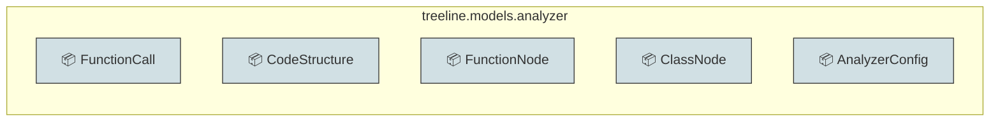

### treeline.models.core

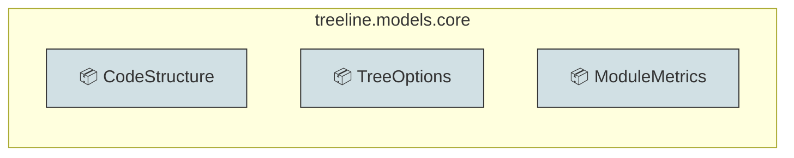

### treeline.models.dependency_analyzer

```mermaid
graph TD

    %% Styling
    classDef fnNode fill:#e4d1d1,stroke:#333
    classDef clsNode fill:#d1e0e4,stroke:#333

    subgraph treeline_models_dependency_analyzer["treeline.models.dependency_analyzer"]
        direction TB
        treeline_models_dependency_analyzer_FunctionLocation["📦 FunctionLocation"]:::clsNode
        treeline_models_dependency_analyzer_FunctionCallInfo["📦 FunctionCallInfo"]:::clsNode
        treeline_models_dependency_analyzer_ClassMethod["📦 ClassMethod"]:::clsNode
        treeline_models_dependency_analyzer_ClassInfo["📦 ClassInfo"]:::clsNode
        treeline_models_dependency_analyzer_ModuleMetrics["📦 ModuleMetrics"]:::clsNode
        treeline_models_dependency_analyzer_ComplexFunction["📦 ComplexFunction"]:::clsNode
        treeline_models_dependency_analyzer_MethodInfo["📦 MethodInfo"]:::clsNode
        treeline_models_dependency_analyzer_Node["📦 Node"]:::clsNode
        treeline_models_dependency_analyzer_Node___post_init__["⚡ __post_init__"]:::fnNode
        treeline_models_dependency_analyzer_Node --> treeline_models_dependency_analyzer_Node___post_init__
        treeline_models_dependency_analyzer_Link["📦 Link"]:::clsNode
        treeline_models_dependency_analyzer_GraphData["📦 GraphData"]:::clsNode
    end

```

### treeline.models.enhanced_analyzer

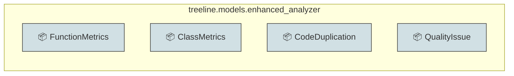

### treeline.type_checker

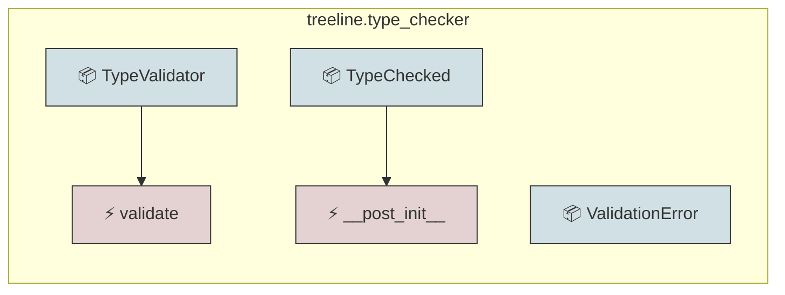

## Directory Structure

```

├─ assets
│ ├─ screenshot1.png
│ └─ Treeline.png
├─ docs
│ ├─ _static
│ ├─ build
│ │ ├─ doctrees
│ │ │ ├─ code_analysis.doctree
│ │ │ ├─ environment.pickle
│ │ │ ├─ git_integration.doctree
│ │ │ ├─ index.doctree
│ │ │ ├─ installation.doctree
│ │ │ ├─ quickstart.doctree
│ │ │ ├─ user_guide.doctree
│ │ │ └─ visualization.doctree
│ │ └─ html
│ │   ├─ _sources
│ │   │ ├─ code_analysis.rst.txt
│ │   │ ├─ git_integration.rst.txt
│ │   │ ├─ index.rst.txt
│ │   │ ├─ installation.rst.txt
│ │   │ ├─ quickstart.rst.txt
│ │   │ ├─ user_guide.rst.txt
│ │   │ └─ visualization.rst.txt
│ │   ├─ _static
│ │   │ ├─ css
│ │   │ │ ├─ fonts
│ │   │ │ │ ├─ fontawesome-webfont.eot
│ │   │ │ │ ├─ fontawesome-webfont.svg
│ │   │ │ │ ├─ fontawesome-webfont.ttf
│ │   │ │ │ ├─ fontawesome-webfont.woff
│ │   │ │ │ ├─ fontawesome-webfont.woff2
│ │   │ │ │ ├─ lato-bold-italic.woff
│ │   │ │ │ ├─ lato-bold-italic.woff2
│ │   │ │ │ ├─ lato-bold.woff
│ │   │ │ │ ├─ lato-bold.woff2
│ │   │ │ │ ├─ lato-normal-italic.woff
│ │   │ │ │ ├─ lato-normal-italic.woff2
│ │   │ │ │ ├─ lato-normal.woff
│ │   │ │ │ ├─ lato-normal.woff2
│ │   │ │ │ ├─ Roboto-Slab-Bold.woff
│ │   │ │ │ ├─ Roboto-Slab-Bold.woff2
│ │   │ │ │ ├─ Roboto-Slab-Regular.woff
│ │   │ │ │ └─ Roboto-Slab-Regular.woff2
│ │   │ │ ├─ badge_only.css
│ │   │ │ └─ theme.css
│ │   │ ├─ fonts
│ │   │ │ ├─ Lato
│ │   │ │ │ ├─ lato-bold.eot
│ │   │ │ │ ├─ lato-bold.ttf
│ │   │ │ │ ├─ lato-bold.woff
│ │   │ │ │ ├─ lato-bold.woff2
│ │   │ │ │ ├─ lato-bolditalic.eot
│ │   │ │ │ ├─ lato-bolditalic.ttf
│ │   │ │ │ ├─ lato-bolditalic.woff
│ │   │ │ │ ├─ lato-bolditalic.woff2
│ │   │ │ │ ├─ lato-italic.eot
│ │   │ │ │ ├─ lato-italic.ttf
│ │   │ │ │ ├─ lato-italic.woff
│ │   │ │ │ ├─ lato-italic.woff2
│ │   │ │ │ ├─ lato-regular.eot
│ │   │ │ │ ├─ lato-regular.ttf
│ │   │ │ │ ├─ lato-regular.woff
│ │   │ │ │ └─ lato-regular.woff2
│ │   │ │ └─ RobotoSlab
│ │   │ │   ├─ roboto-slab-v7-bold.eot
│ │   │ │   ├─ roboto-slab-v7-bold.ttf
│ │   │ │   ├─ roboto-slab-v7-bold.woff
│ │   │ │   ├─ roboto-slab-v7-bold.woff2
│ │   │ │   ├─ roboto-slab-v7-regular.eot
│ │   │ │   ├─ roboto-slab-v7-regular.ttf
│ │   │ │   ├─ roboto-slab-v7-regular.woff
│ │   │ │   └─ roboto-slab-v7-regular.woff2
│ │   │ ├─ js
│ │   │ │ ├─ badge_only.js
│ │   │ │ ├─ theme.js
│ │   │ │ └─ versions.js
│ │   │ ├─ _sphinx_javascript_frameworks_compat.js
│ │   │ ├─ basic.css
│ │   │ ├─ doctools.js
│ │   │ ├─ documentation_options.js
│ │   │ ├─ file.png
│ │   │ ├─ jquery.js
│ │   │ ├─ language_data.js
│ │   │ ├─ minus.png
│ │   │ ├─ plus.png
│ │   │ ├─ pygments.css
│ │   │ ├─ searchtools.js
│ │   │ └─ sphinx_highlight.js
│ │   ├─ .buildinfo
│ │   ├─ .buildinfo.bak
│ │   ├─ code_analysis.html
│ │   ├─ genindex.html
│ │   ├─ git_integration.html
│ │   ├─ index.html
│ │   ├─ installation.html
│ │   ├─ objects.inv
│ │   ├─ quickstart.html
│ │   ├─ search.html
│ │   ├─ searchindex.js
│ │   ├─ user_guide.html
│ │   └─ visualization.html
│ ├─ code_analysis.rst
│ ├─ conf.py
│ ├─ git_integration.rst
│ ├─ index.rst
│ ├─ installation.rst
│ ├─ make.bat
│ ├─ Makefile
│ ├─ quickstart.rst
│ ├─ requirements.txt
│ ├─ user_guide.rst
│ └─ visualization.rst
├─ example
│ ├─ sample.py
│ │   **Class**: ◆ Calculator
│ │   └─ # A simple calculator class.
│ │   **Function**: → main
│ │   **Function**: → __init__
│ │   **Function**: → add
│ │   └─ # Add two numbers.
│ │   **Function**: → multiply
│ │   └─ # Multiply two numbers.
│ ├─ tree.md
│ └─ tut1.ipynb
├─ results
│ ├─ code_analysis.html
│ ├─ code_analysis.md
│ └─ code_visualization.html
├─ tests
│ ├─ test_core.py
│ │   **Class**: ◆ TestTreeGenerator
│ │   └─ ! Missing class docstring
│ │   **Function**: → setUp
│ │   **Function**: → tearDown
│ │   **Function**: → test_tree_structure
│ │   └─ # Test if the tree structure is generated correctly
│ │   **Function**: → test_markdown_creation
│ │   └─ # Test if markdown file is created when flag is True
│ ├─ test_empty_dir.py
│ │   **Class**: ◆ TestEmptyDirectory
│ │   └─ ! Missing class docstring
│ │   **Function**: → setUp
│ │   └─ # Set up test directory
│ │   **Function**: → tearDown
│ │   └─ # Clean up test directory
│ │   **Function**: → test_empty_directory
│ │   └─ # Test handling of empty directory
│ ├─ test_nested_dir.py
│ │   **Class**: ◆ TestNestedDirectories
│ │   └─ ! Missing class docstring
│ │   **Function**: → setUp
│ │   └─ # Set up test directory
│ │   **Function**: → tearDown
│ │   └─ # Clean up test directory
│ │   **Function**: → test_nested_directories
│ │   └─ # Test handling of nested directories
│ ├─ test_special_char.py
│ │   **Class**: ◆ TestSpecialCharacters
│ │   └─ ! Missing class docstring
│ │   **Function**: → setUp
│ │   └─ # Set up test directory
│ │   **Function**: → tearDown
│ │   └─ # Clean up test directory
│ │   **Function**: → test_special_characters
│ │   └─ # Test handling of special characters in names
│ └─ test_treeline.py
│     **Class**: ◆ TestTreeLine
│     └─ ! Missing class docstring
│     **Function**: → setUp
│     **Function**: → tearDown
│     **Function**: → test_basic_tree
│     └─ # Test if tree structure is generated correctly
├─ treeline
│ ├─ models
│ │ ├─ __init__.py
│ │ ├─ analyzer.py
│ │ │   **Class**: ◆ FunctionCall
│ │ │   └─ ! Missing class docstring
│ │ │   └─ ! Too few public method (< 1, SOLID-ISP)
│ │ │   **Class**: ◆ CodeStructure
│ │ │   └─ ! Missing class docstring
│ │ │   └─ ! Too few public method (< 1, SOLID-ISP)
│ │ │   **Class**: ◆ FunctionNode
│ │ │   └─ ! Missing class docstring
│ │ │   └─ ! Too few public method (< 1, SOLID-ISP)
│ │ │   **Class**: ◆ ClassNode
│ │ │   └─ ! Missing class docstring
│ │ │   └─ ! Too few public method (< 1, SOLID-ISP)
│ │ │   **Class**: ◆ AnalyzerConfig
│ │ │   └─ ! Missing class docstring
│ │ │   └─ ! Too few public method (< 1, SOLID-ISP)
│ │ ├─ core.py
│ │ │   **Class**: ◆ CodeStructure
│ │ │   └─ ! Missing class docstring
│ │ │   └─ ! Too few public method (< 1, SOLID-ISP)
│ │ │   **Class**: ◆ TreeOptions
│ │ │   └─ ! Missing class docstring
│ │ │   └─ ! Too few public method (< 1, SOLID-ISP)
│ │ │   **Class**: ◆ ModuleMetrics
│ │ │   └─ ! Missing class docstring
│ │ │   └─ ! Too few public method (< 1, SOLID-ISP)
│ │ ├─ dependency_analyzer.py
│ │ │   **Class**: ◆ FunctionLocation
│ │ │   └─ ! Missing class docstring
│ │ │   └─ ! Too few public method (< 1, SOLID-ISP)
│ │ │   **Class**: ◆ FunctionCallInfo
│ │ │   └─ ! Missing class docstring
│ │ │   └─ ! Too few public method (< 1, SOLID-ISP)
│ │ │   **Class**: ◆ ClassMethod
│ │ │   └─ ! Missing class docstring
│ │ │   └─ ! Too few public method (< 1, SOLID-ISP)
│ │ │   **Class**: ◆ ClassInfo
│ │ │   └─ ! Missing class docstring
│ │ │   └─ ! Too few public method (< 1, SOLID-ISP)
│ │ │   **Class**: ◆ ModuleMetrics
│ │ │   └─ ! Missing class docstring
│ │ │   └─ ! Too few public method (< 1, SOLID-ISP)
│ │ │   **Class**: ◆ ComplexFunction
│ │ │   └─ ! Missing class docstring
│ │ │   └─ ! Too few public method (< 1, SOLID-ISP)
│ │ │   **Class**: ◆ MethodInfo
│ │ │   └─ ! Missing class docstring
│ │ │   └─ ! Too few public method (< 1, SOLID-ISP)
│ │ │   **Class**: ◆ Node
│ │ │   └─ ! Missing class docstring
│ │ │   └─ ! Too few public method (< 1, SOLID-ISP)
│ │ │   **Class**: ◆ Link
│ │ │   └─ ! Missing class docstring
│ │ │   └─ ! Too few public method (< 1, SOLID-ISP)
│ │ │   **Class**: ◆ GraphData
│ │ │   └─ ! Missing class docstring
│ │ │   └─ ! Too few public method (< 1, SOLID-ISP)
│ │ │   **Function**: → __post_init__
│ │ └─ enhanced_analyzer.py
│ │     **Class**: ◆ FunctionMetrics
│ │     └─ ! Missing class docstring
│ │     └─ ! Too few public method (< 1, SOLID-ISP)
│ │     **Class**: ◆ ClassMetrics
│ │     └─ ! Missing class docstring
│ │     └─ ! Too few public method (< 1, SOLID-ISP)
│ │     **Class**: ◆ CodeDuplication
│ │     └─ ! Missing class docstring
│ │     └─ ! Too few public method (< 1, SOLID-ISP)
│ │     **Class**: ◆ QualityIssue
│ │     └─ ! Missing class docstring
│ │     └─ ! Too few public method (< 1, SOLID-ISP)
│ ├─ __init__.py
│ │   **Function**: → __call__
│ ├─ __main__.py
│ ├─ analyzer.py
│ │   **Class**: ◆ CodeAnalyzer
│ │   └─ # Simple analyzer for extracting functions and classes from Python files.
│ │   └─ ! High complexity (34)
│ │   └─ ! Too long (207 lines)
│ │   └─ ! Class too long
│ │   **Function**: → __init__
│ │   **Function**: → analyze_file
│ │   └─ # Extracts functions and classes with optional params and relationships.
│ │   └─ ! High complexity (12)
│ │   └─ ! Too long (99 lines)
│ │   └─ ! Deep nesting (depth 7)
│ │   └─ ! Function exceeds 50 lines
│ │   └─ ! High cyclomatic complexity(> 10)
│ │   └─ ! High cognitive complexity (> 15)
│ │   └─ ! Excessive nesting depth (> 4)
│ │   └─ ! High cognitive load (> 7 items)
│ │   **Function**: → _get_function_params
│ │   └─ # Extract function parameters with type hints.
│ │   **Function**: → _find_function_calls
│ │   **Function**: → get_symbol
│ │   └─ # Maps item types to their display symbols.
│ │   **Function**: → format_structure
│ │   └─ # Formats the code structure into displayable lines with colors and prefixes.
│ │   └─ ! High cognitive load (> 7 items)
│ ├─ core.py
│ │   **Function**: → create_default_ignore
│ │   └─ # Create default .treeline-ignore if it doesn't exist
│ │   **Function**: → read_ignore_patterns
│ │   └─ # Read patterns from .treeline-ignore file
│ │   **Function**: → should_ignore
│ │   └─ # Check if path should be ignored based on patterns
│ │   └─ ! High cognitive complexity (> 15)
│ │   └─ ! High cognitive load (> 7 items)
│ │   **Function**: → format_structure
│ │   └─ # Format the analysis results into a readable tree structure.
│ │    Args:
│ │    structure: List of analysis results
│ │    indent: String to use for indentation
│ │    Returns:
│ │    List of formatted strings representing the code structure
│ │   └─ ! High complexity (13)
│ │   └─ ! Too long (61 lines)
│ │   └─ ! Function exceeds 50 lines
│ │   └─ ! High cyclomatic complexity(> 10)
│ │   └─ ! High cognitive complexity (> 15)
│ │   └─ ! High cognitive load (> 7 items)
│ │   **Function**: → generate_tree
│ │   └─ # Generate tree structure with code quality and security analysis.
│ │   └─ ! High complexity (14)
│ │   └─ ! Too long (76 lines)
│ │   └─ ! Deep nesting (depth 7)
│ │   └─ ! Function exceeds 50 lines
│ │   └─ ! High cyclomatic complexity(> 10)
│ │   └─ ! High cognitive complexity (> 15)
│ │   └─ ! Excessive nesting depth (> 4)
│ │   └─ ! High cognitive load (> 7 items)
│ │   **Function**: → main
│ │   └─ ! Too long (51 lines)
│ │   └─ ! Function exceeds 50 lines
│ │   **Function**: → add_directory
│ │   └─ ! Deep nesting (depth 7)
│ │   └─ ! High cognitive complexity (> 15)
│ │   └─ ! Excessive nesting depth (> 4)
│ │   └─ ! High cognitive load (> 7 items)
│ ├─ default_ignore
│ ├─ dependency_analyzer.py
│ │   **Class**: ◆ ModuleDependencyAnalyzer
│ │   └─ # Analyzes module-level dependencies and generates summary reports.
│ │   └─ ! High complexity (92)
│ │   └─ ! Too long (1211 lines)
│ │   └─ ! Class too long
│ │   └─ ! Too many methods
│ │   └─ ! High class complexity
│ │   **Function**: → __init__
│ │   └─ ! Too long (485 lines)
│ │   └─ ! Function exceeds 50 lines
│ │   **Function**: → analyze_directory
│ │   └─ # Analyze all Python files in directory.
│ │   **Function**: → _analyze_module
│ │   └─ # Analyze a single module's contents and relationships.
│ │   └─ ! High complexity (15)
│ │   └─ ! Too long (52 lines)
│ │   └─ ! Deep nesting (depth 7)
│ │   └─ ! Function exceeds 50 lines
│ │   └─ ! High cyclomatic complexity(> 10)
│ │   └─ ! High cognitive complexity (> 15)
│ │   └─ ! Excessive nesting depth (> 4)
│ │   └─ ! High cognitive load (> 7 items)
│ │   **Function**: → _analyze_imports
│ │   └─ # Collect import information from AST.
│ │   └─ ! High cognitive load (> 7 items)
│ │   **Function**: → _collect_metrics
│ │   └─ # Collect code metrics for the module.
│ │   **Function**: → _calculate_complexity
│ │   └─ # Calculate cyclomatic complexity.
│ │   **Function**: → generate_module_overview_diagram
│ │   └─ # Generate a Mermaid diagram showing modules and their relationships.
│ │   **Function**: → generate_module_detail_diagram
│ │   └─ # Generate a Mermaid diagram showing functions and classes in a module.
│ │   └─ ! High complexity (17)
│ │   └─ ! Too long (59 lines)
│ │   └─ ! Deep nesting (depth 5)
│ │   └─ ! Function exceeds 50 lines
│ │   └─ ! High cyclomatic complexity(> 10)
│ │   └─ ! High cognitive complexity (> 15)
│ │   └─ ! Excessive nesting depth (> 4)
│ │   └─ ! High cognitive load (> 7 items)
│ │   **Function**: → generate_mermaid_graphs
│ │   └─ # Generate a markdown report with multiple focused Mermaid graphs.
│ │   **Function**: → generate_html_visualization
│ │   └─ # Generate an interactive HTML visualization using D3.js
│ │   └─ ! High complexity (18)
│ │   └─ ! Too long (177 lines)
│ │   └─ ! Function exceeds 50 lines
│ │   └─ ! High cyclomatic complexity(> 10)
│ │   └─ ! High cognitive complexity (> 15)
│ │   └─ ! High cognitive load (> 7 items)
│ │   **Function**: → clean_for_markdown
│ │   └─ # Remove ANSI colors and simplify symbols for markdown.
│ │   **Function**: → generate_reports
│ │   └─ # Generate comprehensive HTML and markdown reports of the code analysis.
│ │   └─ ! High complexity (12)
│ │   └─ ! Too long (226 lines)
│ │   └─ ! Deep nesting (depth 6)
│ │   └─ ! Function exceeds 50 lines
│ │   └─ ! High cyclomatic complexity(> 10)
│ │   └─ ! High cognitive complexity (> 15)
│ │   └─ ! Excessive nesting depth (> 4)
│ │   └─ ! High cognitive load (> 7 items)
│ ├─ enhanced_analyzer.py
│ │   **Class**: ◆ EnhancedCodeAnalyzer
│ │   └─ # Enhanced analyzer for code quality and maintainability metrics.
│ │    This analyzer implements industry-standard code quality checks and metrics
│ │    following Clean Code principles, SOLID principles, and PEP 8 standards.
│ │   └─ ! High complexity (123)
│ │   └─ ! Too long (606 lines)
│ │   └─ ! Class too long
│ │   └─ ! Too many methods
│ │   └─ ! High class complexity
│ │   **Function**: → __init__
│ │   └─ # Initialize the code analyzer.
│ │    Args:
│ │    show_params: Whether to show function parameters in analysis
│ │   **Function**: → analyze_file
│ │   └─ # Analyze a Python file for code quality metrics.
│ │    Args:
│ │    file_path: Path to the Python file to analyze
│ │    Returns:
│ │    List of analysis results for each code element
│ │   **Function**: → _calculate_maintainability_index
│ │   └─ # Calculate Maintainability Index (MI) following Microsoft's formula.
│ │    MI = max(0, (171 - 5.2 * ln(HV) - 0.23 * CC - 16.2 * ln(LOC)) * 100 / 171)
│ │    where:
│ │    - HV = Halstead Volume
│ │    - CC = Cyclomatic Complexity
│ │    - LOC = Lines of Code
│ │   **Function**: → _calculate_cognitive_load
│ │   └─ # Counts control structures and parameters as cognitive items.
│ │   **Function**: → _check_function_metrics
│ │   └─ # Check function metrics against quality thresholds.
│ │   └─ ! High cognitive load (> 7 items)
│ │   **Function**: → _calculate_cyclomatic_complexity
│ │   └─ # Calculate McCabe's cyclomatic complexity.
│ │    Based on McCabe, 1976 and implementation in Radon/SonarQube.
│ │   **Function**: → _calculate_cognitive_complexity
│ │   └─ # Calculate cognitive complexity based on SonarQube's metric.
│ │    Implements SonarSource's cognitive complexity calculation.
│ │   **Function**: → _analyze_file_metrics
│ │   └─ # Analyze file-level metrics including style, duplication, imports, and documentation.
│ │    Args:
│ │    content: File content as string
│ │    file_path: Path to the file being analyzed
│ │   └─ ! High complexity (13)
│ │   └─ ! Too long (66 lines)
│ │   └─ ! Function exceeds 50 lines
│ │   └─ ! High cyclomatic complexity(> 10)
│ │   └─ ! High cognitive complexity (> 15)
│ │   └─ ! High cognitive load (> 7 items)
│ │   **Function**: → _read_file
│ │   └─ # Read and return file content safely.
│ │   **Function**: → _parse_content
│ │   └─ # Parse Python content into AST safely.
│ │   **Function**: → _analyze_code_elements
│ │   └─ # Analyze individual code elements in the AST.
│ │   **Function**: → _analyze_class
│ │   └─ # Analyze a class's quality metrics.
│ │   **Function**: → _check_class_metrics
│ │   └─ # Check class metrics against quality thresholds.
│ │   └─ ! High cognitive load (> 7 items)
│ │   **Function**: → format_structure
│ │   └─ # Format the analysis results into a tree structure.
│ │   └─ ! High complexity (15)
│ │   └─ ! Too long (56 lines)
│ │   └─ ! Function exceeds 50 lines
│ │   └─ ! High cyclomatic complexity(> 10)
│ │   └─ ! High cognitive complexity (> 15)
│ │   └─ ! High cognitive load (> 7 items)
│ │   **Function**: → _format_metrics_section
│ │   └─ # Format the metrics section of the report.
│ │   **Function**: → _analyze_function
│ │   └─ # Analyze a function's quality metrics.
│ │   **Function**: → _calculate_class_metrics
│ │   **Function**: → _calculate_function_metrics
│ │   **Function**: → _calculate_complexity
│ │   └─ # Calculate cyclomatic complexity of code.
│ │   **Function**: → _calculate_nested_depth
│ │   └─ # Calculate maximum nesting depth in code.
│ │   **Function**: → _analyze_code_duplication
│ │   └─ # Analyze code for duplication using line-based comparison.
│ │   **Function**: → _analyze_imports
│ │   └─ # Analyze import statements and module dependencies.
│ │   **Function**: → _analyze_inheritance
│ │   └─ # Analyze class inheritance depth and hierarchy.
│ │   **Function**: → _add_issue
│ │   └─ # Add a quality issue to the collection.
│ │    Args:
│ │    category: The category of the issue
│ │    description: Description of the issue
│ │    file_path: Optional path to the file where the issue was found
│ │    line: Optional line number where the issue was found
│ │   **Function**: → generate_report
│ │   └─ # Generate a formatted quality report.
│ │   **Function**: → _format_report_sections
│ │   └─ # Format and combine report sections.
│ │   **Function**: → _format_overview_section
│ │   └─ # Format the report overview section.
│ │   **Function**: → _format_issues_section
│ │   └─ # Format the quality issues section.
│ │   **Function**: → walk_cognitive
│ │   **Function**: → get_depth
│ │   **Function**: → get_inheritance_depth
│ └─ type_checker.py
│     **Class**: ◆ TypeValidator
│     └─ ! High complexity (22)
│     └─ ! Too long (62 lines)
│     └─ ! Missing class docstring
│     **Class**: ◆ TypeChecked
│     └─ # Base class for type-checked dataclasses
│     └─ ! Too few public method (< 1, SOLID-ISP)
│     **Class**: ◆ ValidationError
│     └─ # Raised when type validation fails
│     └─ ! Too few public method (< 1, SOLID-ISP)
│     **Function**: → validate
│     └─ # Validates that a value matches the expected type, with support for generics.
│      Args:
│      value: The value to validate
│      expected_type: The expected type (can be a generic type)
│      Raises:
│      TypeError: If the value doesn't match the expected type
│     └─ ! High complexity (22)
│     └─ ! Too long (60 lines)
│     └─ ! Deep nesting (depth 6)
│     └─ ! Function exceeds 50 lines
│     └─ ! High cyclomatic complexity(> 10)
│     └─ ! High cognitive complexity (> 15)
│     └─ ! Excessive nesting depth (> 4)
│     └─ ! High cognitive load (> 7 items)
│     **Function**: → __post_init__
│     └─ # Validate types after initialization
├─ treeline.egg-info
│ ├─ dependency_links.txt
│ ├─ entry_points.txt
│ ├─ PKG-INFO
│ ├─ requires.txt
│ ├─ SOURCES.txt
│ └─ top_level.txt
├─ .dockerignore
├─ .editorconfig
├─ .pre-commit-config.yaml
├─ .readthedocs.yaml
├─ .treeline-ignore
├─ docker-compose.yaml
├─ dockerfile
├─ License
├─ pyproject.toml
├─ README.md
├─ setup.py
└─ tox.ini
```

## Code Quality Metrics

### docs.conf
- Functions: **0**
- Classes: **0**
- Complexity: **0**

### example.sample
- Functions: **4**
- Classes: **1**
- Complexity: **4**

Classes:

#### 📦 Calculator
- Defined at line 1
- Methods:
  - ⚡ __init__ (line 4)
  - ⚡ add (line 7)
  - ⚡ multiply (line 11)
### setup
- Functions: **0**
- Classes: **0**
- Complexity: **0**

### tests.test_core
- Functions: **4**
- Classes: **1**
- Complexity: **5**

Classes:

#### 📦 TestTreeGenerator
- Defined at line 10
- Methods:
  - ⚡ setUp (line 11)
    Calls: Path, Path
  - ⚡ tearDown (line 19)
  - ⚡ test_tree_structure (line 24)
    Calls: generate_tree
  - ⚡ test_markdown_creation (line 36)
    Calls: generate_tree
### tests.test_empty_dir
- Functions: **3**
- Classes: **1**
- Complexity: **4**

Classes:

#### 📦 TestEmptyDirectory
- Defined at line 8
- Methods:
  - ⚡ setUp (line 9)
  - ⚡ tearDown (line 14)
  - ⚡ test_empty_directory (line 19)
    Calls: generate_tree
### tests.test_nested_dir
- Functions: **3**
- Classes: **1**
- Complexity: **4**

Classes:

#### 📦 TestNestedDirectories
- Defined at line 8
- Methods:
  - ⚡ setUp (line 9)
  - ⚡ tearDown (line 14)
  - ⚡ test_nested_directories (line 21)
    Calls: generate_tree, Path
### tests.test_special_char
- Functions: **3**
- Classes: **1**
- Complexity: **4**

Classes:

#### 📦 TestSpecialCharacters
- Defined at line 8
- Methods:
  - ⚡ setUp (line 9)
  - ⚡ tearDown (line 14)
  - ⚡ test_special_characters (line 21)
    Calls: generate_tree, Path
### tests.test_treeline
- Functions: **3**
- Classes: **1**
- Complexity: **3**

Classes:

#### 📦 TestTreeLine
- Defined at line 9
- Methods:
  - ⚡ setUp (line 10)
    Calls: open, open
  - ⚡ tearDown (line 18)
  - ⚡ test_basic_tree (line 21)
    Calls: treeline, str
### treeline.__init__
- Functions: **1**
- Classes: **0**
- Complexity: **1**

### treeline.__main__
- Functions: **0**
- Classes: **0**
- Complexity: **0**

### treeline.analyzer
- Functions: **6**
- Classes: **1**
- Complexity: **<span style='color: red'>34</span>**

Classes:

#### 📦 CodeAnalyzer
- Defined at line 10
- Methods:
  - ⚡ __init__ (line 23)
    Calls: defaultdict
  - ⚡ analyze_file (line 28)
    Calls: open, CodeStructure, isinstance, CodeStructure, isinstance, print, CodeStructure, str, isinstance
  - ⚡ _get_function_params (line 128)
    Calls: hasattr, hasattr, hasattr
  - ⚡ _find_function_calls (line 150)
    Calls: set, isinstance, isinstance, FunctionCall, print
  - ⚡ get_symbol (line 162)
  - ⚡ format_structure (line 167)
### treeline.core
- Functions: **7**
- Classes: **0**
- Complexity: **<span style='color: red'>50</span>**

### treeline.dependency_analyzer
- Functions: **12**
- Classes: **1**
- Complexity: **<span style='color: red'>92</span>**

Classes:

#### 📦 ModuleDependencyAnalyzer
- Defined at line 20
- Methods:
  - ⚡ __init__ (line 23)
    Calls: defaultdict, defaultdict, defaultdict, defaultdict, defaultdict, defaultdict, defaultdict, defaultdict
  - ⚡ analyze_directory (line 509)
    Calls: open, str, print, str
  - ⚡ _analyze_module (line 527)
    Calls: isinstance, setattr, getattr, isinstance, isinstance, FunctionLocation, isinstance, isinstance, isinstance, FunctionCallInfo, MethodInfo, isinstance, isinstance
  - ⚡ _analyze_imports (line 580)
    Calls: isinstance, isinstance
  - ⚡ _collect_metrics (line 590)
    Calls: ModuleMetrics, isinstance, isinstance, len, len, ComplexFunction
  - ⚡ _calculate_complexity (line 622)
    Calls: isinstance, isinstance, len
  - ⚡ generate_module_overview_diagram (line 632)
    Calls: set
  - ⚡ generate_module_detail_diagram (line 658)
    Calls: set
  - ⚡ generate_mermaid_graphs (line 718)
    Calls: sorted
  - ⚡ generate_html_visualization (line 804)
    Calls: set, len, len, Node, Link, len, len, len
  - ⚡ clean_for_markdown (line 982)
  - ⚡ generate_reports (line 1005)
    Calls: Path, sorted, range, print, print, print, print, print, open, str, sorted, open, open, str
### treeline.enhanced_analyzer
- Functions: **31**
- Classes: **1**
- Complexity: **<span style='color: red'>123</span>**

Classes:

#### 📦 EnhancedCodeAnalyzer
- Defined at line 13
- Methods:
  - ⚡ __init__ (line 44)
    Calls: defaultdict, defaultdict
  - ⚡ analyze_file (line 55)
  - ⚡ _calculate_maintainability_index (line 76)
    Calls: len, len, max, isinstance, isinstance, len, set
  - ⚡ _calculate_cognitive_load (line 110)
    Calls: sum, len, isinstance
  - ⚡ _check_function_metrics (line 122)
  - ⚡ _calculate_cyclomatic_complexity (line 171)
    Calls: isinstance, isinstance, len
  - ⚡ _calculate_cognitive_complexity (line 185)
    Calls: walk_cognitive, isinstance, walk_cognitive, isinstance, walk_cognitive, len
  - ⚡ _analyze_file_metrics (line 208)
    Calls: enumerate, isinstance, len, str, str, str, str, len, len, str, str, len
  - ⚡ _read_file (line 275)
    Calls: open, str
  - ⚡ _parse_content (line 284)
    Calls: str
  - ⚡ _analyze_code_elements (line 292)
    Calls: isinstance, isinstance
  - ⚡ _analyze_class (line 304)
  - ⚡ _check_class_metrics (line 317)
  - ⚡ format_structure (line 367)
    Calls: isinstance
  - ⚡ _format_metrics_section (line 424)
    Calls: isinstance
  - ⚡ _analyze_function (line 443)
  - ⚡ _calculate_class_metrics (line 456)
    Calls: ClassMetrics, isinstance, len, sum, bool, len, len, len
  - ⚡ _calculate_function_metrics (line 473)
    Calls: FunctionMetrics, len, len, bool, len, isinstance
  - ⚡ _calculate_complexity (line 488)
    Calls: isinstance, isinstance, len
  - ⚡ _calculate_nested_depth (line 498)
    Calls: get_depth, isinstance, get_depth, max, max, get_depth
  - ⚡ _analyze_code_duplication (line 513)
    Calls: set, range, len, range, len, len, len, len, len, range, range
  - ⚡ _analyze_imports (line 540)
    Calls: set, isinstance, len, isinstance
  - ⚡ _analyze_inheritance (line 557)
    Calls: get_inheritance_depth, isinstance, max
  - ⚡ _add_issue (line 570)
    Calls: QualityIssue
  - ⚡ generate_report (line 585)
  - ⚡ _format_report_sections (line 595)
  - ⚡ _format_overview_section (line 599)
  - ⚡ _format_issues_section (line 606)
### treeline.models.__init__
- Functions: **0**
- Classes: **0**
- Complexity: **0**

### treeline.models.analyzer
- Functions: **0**
- Classes: **5**
- Complexity: **0**

Classes:

#### 📦 FunctionCall
- Defined at line 8

#### 📦 CodeStructure
- Defined at line 14

#### 📦 FunctionNode
- Defined at line 23

#### 📦 ClassNode
- Defined at line 32

#### 📦 AnalyzerConfig
- Defined at line 41
### treeline.models.core
- Functions: **0**
- Classes: **3**
- Complexity: **0**

Classes:

#### 📦 CodeStructure
- Defined at line 9

#### 📦 TreeOptions
- Defined at line 18

#### 📦 ModuleMetrics
- Defined at line 27
### treeline.models.dependency_analyzer
- Functions: **1**
- Classes: **10**
- Complexity: **3**

Classes:

#### 📦 FunctionLocation
- Defined at line 7

#### 📦 FunctionCallInfo
- Defined at line 14

#### 📦 ClassMethod
- Defined at line 21

#### 📦 ClassInfo
- Defined at line 27

#### 📦 ModuleMetrics
- Defined at line 35

#### 📦 ComplexFunction
- Defined at line 42

#### 📦 MethodInfo
- Defined at line 49

#### 📦 Node
- Defined at line 55
- Methods:
  - ⚡ __post_init__ (line 62)

#### 📦 Link
- Defined at line 70

#### 📦 GraphData
- Defined at line 77
### treeline.models.enhanced_analyzer
- Functions: **0**
- Classes: **4**
- Complexity: **0**

Classes:

#### 📦 FunctionMetrics
- Defined at line 8

#### 📦 ClassMetrics
- Defined at line 22

#### 📦 CodeDuplication
- Defined at line 35

#### 📦 QualityIssue
- Defined at line 41
### treeline.type_checker
- Functions: **2**
- Classes: **3**
- Complexity: **<span style='color: red'>25</span>**

Classes:

#### 📦 TypeValidator
- Defined at line 5
- Methods:
  - ⚡ validate (line 7)
    Calls: get_origin, get_args, TypeError, get_args, get_origin, type, isinstance, TypeError, len, type, isinstance, TypeError, isinstance, TypeError, zip, isinstance, TypeError, len, len, TypeError, type, type, isinstance, TypeError, type, type, len, len, type

#### 📦 TypeChecked
- Defined at line 70
- Methods:
  - ⚡ __post_init__ (line 73)
    Calls: getattr, TypeError, str

#### 📦 ValidationError
- Defined at line 83

## Complexity Hotspots

### validate
- **Module**: treeline.type_checker
- **Complexity**: <span style='color: red'>22</span>

### generate_html_visualization
- **Module**: treeline.dependency_analyzer
- **Complexity**: <span style='color: red'>18</span>

### generate_module_detail_diagram
- **Module**: treeline.dependency_analyzer
- **Complexity**: <span style='color: red'>17</span>

### _analyze_module
- **Module**: treeline.dependency_analyzer
- **Complexity**: <span style='color: red'>15</span>

### format_structure
- **Module**: treeline.enhanced_analyzer
- **Complexity**: <span style='color: red'>15</span>

### generate_tree
- **Module**: treeline.core
- **Complexity**: <span style='color: red'>14</span>

### _analyze_file_metrics
- **Module**: treeline.enhanced_analyzer
- **Complexity**: <span style='color: red'>13</span>

### format_structure
- **Module**: treeline.core
- **Complexity**: <span style='color: red'>13</span>

### generate_reports
- **Module**: treeline.dependency_analyzer
- **Complexity**: <span style='color: red'>12</span>

### analyze_file
- **Module**: treeline.analyzer
- **Complexity**: <span style='color: red'>12</span>
