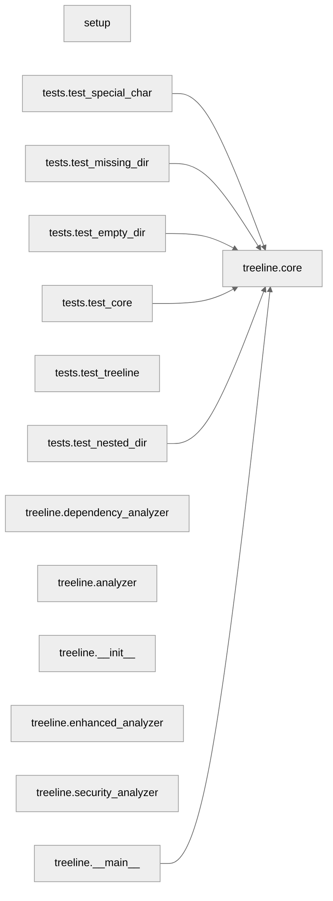

# Project Analysis Report

## Directory Structure

```

├─ example
│ ├─ tree.md
│ └─ tut1.ipynb
├─ tests
│ ├─ test_core.py
│ │   **Class**: ◆ TestTreeGenerator
│ │   └─ Methods: 4
│ │   └─ ▸ Lines: 32
│ │   └─ ! Missing class docstring
│ │
│ │   **Function**: → setUp
│ │   └─ ▸ Lines: 7
│ │   └─ ! Missing docstring
│ │
│ │   **Function**: → tearDown
│ │   └─ ▸ Lines: 2
│ │   └─ ! Missing docstring
│ │
│ │   **Function**: → test_tree_structure
│ │   └─ # Test if the tree structure is generated correctly
│ │   └─ ▸ Lines: 11
│ │
│ │   **Function**: → test_markdown_creation
│ │   └─ # Test if markdown file is created when flag is True
│ │   └─ ▸ Lines: 8
│ ├─ test_empty_dir.py
│ │   **Function**: → test_empty_directory
│ │   └─ # Test handling of empty directory
│ │   └─ ▸ Lines: 6
│ ├─ test_missing_dir.py
│ │   **Function**: → test_non_existent_directory
│ │   └─ # Test handling of non-existent directory
│ │   └─ ▸ Lines: 4
│ ├─ test_nested_dir.py
│ │   **Function**: → test_nested_directories
│ │   └─ # Test handling of nested directories
│ │   └─ ▸ Lines: 11
│ ├─ test_special_char.py
│ │   **Function**: → test_special_characters
│ │   └─ # Test handling of special characters in names
│ │   └─ ▸ Lines: 9
│ └─ test_treeline.py
│     **Class**: ◆ TestTreeLine
│     └─ Methods: 3
│     └─ ▸ Lines: 20
│     └─ ! Missing class docstring
│
│     **Function**: → setUp
│     └─ ▸ Lines: 7
│     └─ ! Missing docstring
│
│     **Function**: → tearDown
│     └─ ▸ Lines: 2
│     └─ ! Missing docstring
│
│     **Function**: → test_basic_tree
│     └─ # Test if tree structure is generated correctly
│     └─ ▸ Lines: 8
├─ treeline
│ ├─ __init__.py
│ │   **Function**: → __call__
│ │   └─ ▸ Lines: 2
│ │   └─ ! Missing docstring
│ ├─ __main__.py
│ ├─ analyzer.py
│ │   **Class**: ◆ CodeAnalyzer
│ │   └─ Methods: 6
│ │   └─ # Simple analyzer for extracting functions and classes from Python files.
│ │   └─ ▸ Lines: 131
│ │
│ │   **Function**: → __init__
│ │   └─ ▸ Lines: 4
│ │   └─ ! Missing docstring
│ │
│ │   **Function**: → analyze_file
│ │   └─ # Extracts functions and classes with optional params and relationships.
│ │   └─ ▸ Lines: 38
│ │   └─ ! Function too long
│ │
│ │   **Function**: → _get_function_params
│ │   └─ # Extract function parameters with type hints.
│ │   └─ ▸ Lines: 21
│ │   └─ ! Function too long
│ │
│ │   **Function**: → _find_function_calls
│ │   └─ # Find all function calls within a node.
│ │   └─ ▸ Lines: 7
│ │
│ │   **Function**: → get_symbol
│ │   └─ # Maps item types to their display symbols.
│ │   └─ ▸ Lines: 8
│ │
│ │   **Function**: → format_structure
│ │   └─ # Formats the code structure into displayable lines with colors and prefixes.
│ │   └─ ▸ Lines: 34
│ │   └─ ! Function too long
│ ├─ core.py
│ │   **Function**: → create_default_ignore
│ │   └─ # Create default .treeline-ignore if it doesn't exist
│ │   └─ ▸ Lines: 6
│ │
│ │   **Function**: → read_ignore_patterns
│ │   └─ # Read patterns from .treeline-ignore file
│ │   └─ ▸ Lines: 7
│ │
│ │   **Function**: → should_ignore
│ │   └─ # Check if path should be ignored based on patterns
│ │   └─ ▸ Lines: 14
│ │
│ │   **Function**: → clean_for_markdown
│ │   └─ # Remove ANSI colors and simplify symbols for markdown.
│ │   └─ ▸ Lines: 22
│ │   └─ ! Function too long
│ │
│ │   **Function**: → format_mermaid_section
│ │   └─ # Format mermaid graph with proper styling and layout.
│ │   └─ ▸ Lines: 12
│ │
│ │   **Function**: → format_structure
│ │   └─ # Format the analysis results into a readable tree structure.

Args:
  structure: List of analysis results
  indent: String to use for indentation
  
Returns:
  List of formatted strings representing the code structure
│ │   └─ ▸ Lines: 49
│ │   └─ ! Function too long
│ │   └─ ! High complexity
│ │
│ │   **Function**: → generate_tree
│ │   └─ # Generate tree structure with code quality and security analysis.
│ │   └─ ▸ Lines: 67
│ │   └─ ! Function too long
│ │   └─ ! Too many parameters
│ │   └─ ! High complexity
│ │
│ │   **Function**: → main
│ │   └─ ▸ Lines: 39
│ │   └─ ! Function too long
│ │   └─ ! Missing docstring
│ │
│ │   **Function**: → add_directory
│ │   └─ ▸ Lines: 18
│ │   └─ ! Missing docstring
│ ├─ default_ignore
│ ├─ dependency_analyzer.py
│ │   **Class**: ◆ ModuleDependencyAnalyzer
│ │   └─ Methods: 7
│ │   └─ # Analyzes module-level dependencies and generates summary reports.
│ │   └─ ▸ Lines: 114
│ │
│ │   **Function**: → __init__
│ │   └─ ▸ Lines: 4
│ │   └─ ! Missing docstring
│ │
│ │   **Function**: → analyze_directory
│ │   └─ # Analyze all Python files in directory.
│ │   └─ ▸ Lines: 14
│ │
│ │   **Function**: → _analyze_imports
│ │   └─ # Collect import information from AST.
│ │   └─ ▸ Lines: 9
│ │
│ │   **Function**: → _collect_metrics
│ │   └─ # Collect code metrics for the module.
│ │   └─ ▸ Lines: 21
│ │   └─ ! Function too long
│ │
│ │   **Function**: → _calculate_complexity
│ │   └─ # Calculate cyclomatic complexity.
│ │   └─ ▸ Lines: 9
│ │
│ │   **Function**: → generate_mermaid_graph
│ │   └─ # Generate Mermaid graph representation of module dependencies.
│ │   └─ ▸ Lines: 16
│ │
│ │   **Function**: → generate_summary_report
│ │   └─ # Generate a readable markdown report without tables.
│ │   └─ ▸ Lines: 32
│ │   └─ ! Function too long
│ ├─ enhanced_analyzer.py
│ │   **Class**: ◆ EnhancedCodeAnalyzer
│ │   └─ Methods: 22
│ │   └─ # Enhanced analyzer for code quality and maintainability metrics.

This analyzer implements industry-standard code quality checks and metrics
following Clean Code principles, SOLID principles, and PEP 8 standards.
│ │   └─ ▸ Lines: 327
│ │   └─ ! Class too long
│ │   └─ ! Too many methods
│ │   └─ ! High class complexity
│ │
│ │   **Function**: → __init__
│ │   └─ # Initialize the code analyzer.

Args:
  show_params: Whether to show function parameters in analysis
│ │   └─ ▸ Lines: 10
│ │
│ │   **Function**: → analyze_file
│ │   └─ # Analyze a Python file for code quality metrics.

Args:
  file_path: Path to the Python file to analyze

Returns:
  List of analysis results for each code element
│ │   └─ ▸ Lines: 20
│ │
│ │   **Function**: → _analyze_file_metrics
│ │   └─ # Analyze file-level metrics for code quality issues.

Args:
  content: The file content as a string
  file_path: Path to the file being analyzed
│ │   └─ ▸ Lines: 30
│ │   └─ ! Function too long
│ │
│ │   **Function**: → _read_file
│ │   └─ # Read and return file content safely.
│ │   └─ ▸ Lines: 8
│ │
│ │   **Function**: → _parse_content
│ │   └─ # Parse Python content into AST safely.
│ │   └─ ▸ Lines: 7
│ │
│ │   **Function**: → _analyze_code_elements
│ │   └─ # Analyze individual code elements in the AST.
│ │   └─ ▸ Lines: 11
│ │
│ │   **Function**: → _analyze_class
│ │   └─ # Analyze a class's quality metrics.
│ │   └─ ▸ Lines: 12
│ │
│ │   **Function**: → _calculate_class_metrics
│ │   └─ # Calculate comprehensive metrics for a class.
│ │   └─ ▸ Lines: 11
│ │
│ │   **Function**: → _check_class_metrics
│ │   └─ # Check class metrics against quality thresholds.
│ │   └─ ▸ Lines: 16
│ │
│ │   **Function**: → format_structure
│ │   └─ # Format analysis results into a readable tree structure.
│ │   └─ ▸ Lines: 38
│ │   └─ ! Function too long
│ │
│ │   **Function**: → _format_metrics_section
│ │   └─ # Format the metrics section of the report.
│ │   └─ ▸ Lines: 18
│ │
│ │   **Function**: → _analyze_function
│ │   └─ # Analyze a function's quality metrics.
│ │   └─ ▸ Lines: 12
│ │
│ │   **Function**: → _calculate_function_metrics
│ │   └─ # Calculate comprehensive metrics for a function.
│ │   └─ ▸ Lines: 10
│ │
│ │   **Function**: → _calculate_complexity
│ │   └─ # Calculate cyclomatic complexity of code.
│ │   └─ ▸ Lines: 9
│ │
│ │   **Function**: → _calculate_nested_depth
│ │   └─ # Calculate maximum nesting depth in code.
│ │   └─ ▸ Lines: 12
│ │
│ │   **Function**: → _check_function_metrics
│ │   └─ # Check function metrics against quality thresholds.
│ │   └─ ▸ Lines: 16
│ │
│ │   **Function**: → _add_issue
│ │   └─ # Add a quality issue to the collection.

Args:
  category: The category of the issue
  description: Description of the issue
  file_path: Optional path to the file where the issue was found
  line: Optional line number where the issue was found
│ │   └─ ▸ Lines: 16
│ │   └─ ! Too many parameters
│ │
│ │   **Function**: → generate_report
│ │   └─ # Generate a formatted quality report.
│ │   └─ ▸ Lines: 7
│ │
│ │   **Function**: → _format_report_sections
│ │   └─ # Format and combine report sections.
│ │   └─ ▸ Lines: 3
│ │
│ │   **Function**: → _format_overview_section
│ │   └─ # Format the report overview section.
│ │   └─ ▸ Lines: 4
│ │
│ │   **Function**: → _format_issues_section
│ │   └─ # Format the quality issues section.
│ │   └─ ▸ Lines: 13
│ │
│ │   **Function**: → get_depth
│ │   └─ ▸ Lines: 9
│ │   └─ ! Missing docstring
│ └─ security_analyzer.py
│     **Class**: ◆ SecurityAnalyzer
│     └─ Methods: 8
│     └─ # Security analyzer for Python code to detect potential vulnerabilities and risks.
Follows OWASP guidelines and common security best practices.
│     └─ ▸ Lines: 230
│     └─ ! Class too long
│
│     **Function**: → __init__
│     └─ # Initialize the security analyzer.
│     └─ ▸ Lines: 4
│
│     **Function**: → analyze_file
│     └─ # Analyze a Python file for security vulnerabilities.

Args:
  file_path: Path to the Python file to analyze

Returns:
  Dictionary containing security analysis results
│     └─ ▸ Lines: 25
│     └─ ! Function too long
│
│     **Function**: → _scan_patterns
│     └─ # Scan code for vulnerable patterns using regex.
│     └─ ▸ Lines: 17
│
│     **Function**: → _analyze_ast_security
│     └─ # Analyze AST for security issues.
│     └─ ▸ Lines: 14
│
│     **Function**: → _check_dangerous_attributes
│     └─ # Check for access to dangerous attributes.
│     └─ ▸ Lines: 19
│
│     **Function**: → _check_dangerous_imports
│     └─ # Check for potentially dangerous imports.
│     └─ ▸ Lines: 21
│     └─ ! Function too long
│
│     **Function**: → _add_security_issue
│     └─ # Add a security issue to the collection.
│     └─ ▸ Lines: 11
│     └─ ! Too many parameters
│
│     **Function**: → generate_security_report
│     └─ # Generate a comprehensive security analysis report.
│     └─ ▸ Lines: 27
│     └─ ! Function too long
├─ treeline.egg-info
│ ├─ dependency_links.txt
│ ├─ entry_points.txt
│ ├─ PKG-INFO
│ ├─ SOURCES.txt
│ └─ top_level.txt
├─ .treeline-ignore
├─ License
├─ README.md
├─ setup.py
└─ tree.md
```

## Module Dependencies


## Code Quality Metrics

### setup
- Functions: **0**
- Classes: **0**
- Complexity: **0**

### tests.test_core
- Functions: **4**
- Classes: **1**
- Complexity: **5**

### tests.test_empty_dir
- Functions: **1**
- Classes: **0**
- Complexity: **1**

### tests.test_missing_dir
- Functions: **1**
- Classes: **0**
- Complexity: **1**

### tests.test_nested_dir
- Functions: **1**
- Classes: **0**
- Complexity: **1**

### tests.test_special_char
- Functions: **1**
- Classes: **0**
- Complexity: **1**

### tests.test_treeline
- Functions: **3**
- Classes: **1**
- Complexity: **3**

### treeline.__init__
- Functions: **1**
- Classes: **0**
- Complexity: **1**

### treeline.__main__
- Functions: **0**
- Classes: **0**
- Complexity: **0**

### treeline.analyzer
- Functions: **6**
- Classes: **1**
- Complexity: **30**

### treeline.core
- Functions: **9**
- Classes: **0**
- Complexity: **48**

### treeline.dependency_analyzer
- Functions: **7**
- Classes: **1**
- Complexity: **28**

### treeline.enhanced_analyzer
- Functions: **22**
- Classes: **1**
- Complexity: **67**

### treeline.security_analyzer
- Functions: **8**
- Classes: **1**
- Complexity: **27**

## Complexity Hotspots

### generate_tree
- **Module**: treeline.core
- **Complexity**: 13

### format_structure
- **Module**: treeline.core
- **Complexity**: 12

