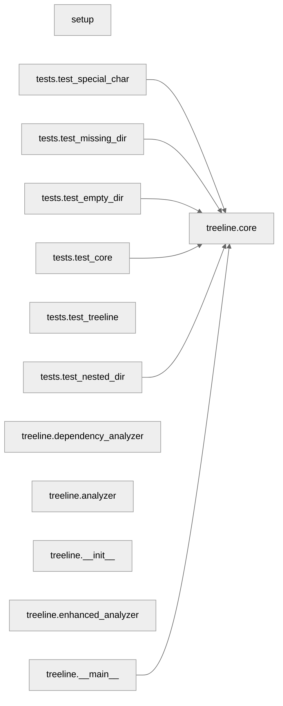

# Project Structure Analysis

## Directory Structure

```

├─ example
│ ├─ tree.md
│ └─ tut1.ipynb
├─ tests
│ ├─ test_core.py
│ │   **Class**: ◆ TestTreeGenerator
│ │   └─ ▸ Lines: 32
│ │
│ │   **Function**: → setUp(self)
│ │   └─ ▸ Lines: 7
│ │
│ │   **Function**: → tearDown(self)
│ │   └─ ▸ Lines: 2
│ │
│ │   **Function**: → test_tree_structure(self)
│ │   └─ # Test if the tree structure is generated correctly
│ │   └─ ▸ Lines: 11
│ │
│ │   **Function**: → test_markdown_creation(self)
│ │   └─ # Test if markdown file is created when flag is True
│ │   └─ ▸ Lines: 8
│ ├─ test_empty_dir.py
│ │   **Function**: → test_empty_directory(self)
│ │   └─ # Test handling of empty directory
│ │   └─ ▸ Lines: 6
│ ├─ test_missing_dir.py
│ │   **Function**: → test_non_existent_directory(self)
│ │   └─ # Test handling of non-existent directory
│ │   └─ ▸ Lines: 4
│ ├─ test_nested_dir.py
│ │   **Function**: → test_nested_directories(self)
│ │   └─ # Test handling of nested directories
│ │   └─ ▸ Lines: 11
│ ├─ test_special_char.py
│ │   **Function**: → test_special_characters(self)
│ │   └─ # Test handling of special characters in names
│ │   └─ ▸ Lines: 9
│ └─ test_treeline.py
│     **Class**: ◆ TestTreeLine
│     └─ ▸ Lines: 20
│
│     **Function**: → setUp(self)
│     └─ ▸ Lines: 7
│
│     **Function**: → tearDown(self)
│     └─ ▸ Lines: 2
│
│     **Function**: → test_basic_tree(self)
│     └─ # Test if tree structure is generated correctly
│     └─ ▸ Lines: 8
├─ treeline
│ ├─ __init__.py
│ │   **Function**: → __call__(*args, **kwargs)
│ │   └─ ▸ Lines: 2
│ ├─ __main__.py
│ ├─ analyzer.py
│ │   **Class**: ◆ CodeAnalyzer
│ │   └─ # Simple analyzer for extracting functions and classes from Python files.
│ │   └─ ▸ Lines: 131
│ │
│ │   **Function**: → __init__(self, show_params, show_relationships)
│ │   └─ ▸ Lines: 4
│ │
│ │   **Function**: → analyze_file(self, file_path: Path)
│ │   └─ # Extracts functions and classes with optional params and relationships.
│ │   └─ ! Long function (38 lines)
│ │   └─ ▸ Lines: 38
│ │
│ │   **Function**: → _get_function_params(self, node) -> str
│ │   └─ # Extract function parameters with type hints.
│ │   └─ ▸ Lines: 21
│ │
│ │   **Function**: → _find_function_calls(self, node)
│ │   └─ # Find all function calls within a node.
│ │   └─ ▸ Lines: 7
│ │
│ │   **Function**: → get_symbol(item_type: str) -> str
│ │   └─ # Maps item types to their display symbols.
│ │   └─ ▸ Lines: 8
│ │
│ │   **Function**: → format_structure(self, structure, indent: str)
│ │   └─ # Formats the code structure into displayable lines with colors and prefixes.
│ │   └─ ! Long function (34 lines)
│ │   └─ ▸ Lines: 34
│ ├─ core.py
│ │   **Function**: → create_default_ignore()
│ │   └─ # Create default .treeline-ignore if it doesn't exist
│ │   └─ ▸ Lines: 6
│ │
│ │   **Function**: → read_ignore_patterns()
│ │   └─ # Read patterns from .treeline-ignore file
│ │   └─ ▸ Lines: 7
│ │
│ │   **Function**: → should_ignore(path, ignore_patterns)
│ │   └─ # Check if path should be ignored based on patterns
│ │   └─ ▸ Lines: 14
│ │
│ │   **Function**: → clean_for_markdown(line: str) -> str
│ │   └─ # Remove ANSI colors and simplify symbols for markdown.
│ │   └─ ▸ Lines: 24
│ │
│ │   **Function**: → format_mermaid_section(dep_analyzer)
│ │   └─ # Format mermaid graph with proper styling and layout.
│ │   └─ ▸ Lines: 12
│ │
│ │   **Function**: → generate_tree(directory, create_md, hide_structure, show_params, show_relationships)
│ │   └─ # Generate tree structure with configurable display options.
│ │   └─ ! High complexity (12)
│ │   └─ ! Long function (67 lines)
│ │   └─ ▸ Lines: 67
│ │
│ │   **Function**: → main()
│ │   └─ ! Long function (43 lines)
│ │   └─ ▸ Lines: 43
│ │
│ │   **Function**: → add_directory(path, prefix)
│ │   └─ ▸ Lines: 17
│ ├─ default_ignore
│ ├─ dependency_analyzer.py
│ │   **Class**: ◆ ModuleDependencyAnalyzer
│ │   └─ # Analyzes module-level dependencies and generates summary reports.
│ │   └─ ▸ Lines: 117
│ │
│ │   **Function**: → __init__(self)
│ │   └─ ▸ Lines: 4
│ │
│ │   **Function**: → analyze_directory(self, directory: Path)
│ │   └─ # Analyze all Python files in directory.
│ │   └─ ▸ Lines: 14
│ │
│ │   **Function**: → _analyze_imports(self, tree, module_name: str)
│ │   └─ # Collect import information from AST.
│ │   └─ ▸ Lines: 9
│ │
│ │   **Function**: → _collect_metrics(self, tree, module_name: str)
│ │   └─ # Collect code metrics for the module.
│ │   └─ ▸ Lines: 21
│ │
│ │   **Function**: → _calculate_complexity(self, node) -> int
│ │   └─ # Calculate cyclomatic complexity.
│ │   └─ ▸ Lines: 9
│ │
│ │   **Function**: → generate_mermaid_graph(self) -> str
│ │   └─ # Generate Mermaid graph representation of module dependencies.
│ │   └─ ▸ Lines: 16
│ │
│ │   **Function**: → generate_summary_report(self) -> str
│ │   └─ # Generate a readable markdown report without tables.
│ │   └─ ! Long function (35 lines)
│ │   └─ ▸ Lines: 35
│ └─ enhanced_analyzer.py
│     **Class**: ◆ EnhancedCodeAnalyzer
│     └─ # Enhanced analyzer focused on code quality metrics.
│     └─ ▸ Lines: 125
│
│     **Function**: → __init__(self, show_params, show_relationships)
│     └─ ▸ Lines: 6
│
│     **Function**: → analyze_file(self, file_path: Path)
│     └─ # Analyzes Python files with additional code quality metrics.
│     └─ ▸ Lines: 30
│
│     **Function**: → format_structure(self, structure, indent: str)
│     └─ # Formats the code structure with metrics on separate lines.
│     └─ ! High complexity (15)
│     └─ ! Long function (45 lines)
│     └─ ▸ Lines: 45
│
│     **Function**: → _analyze_function_metrics(self, node, content: str) -> Dict
│     └─ # Calculate function metrics.
│     └─ ▸ Lines: 17
│
│     **Function**: → _analyze_class_metrics(self, node, content: str) -> Dict
│     └─ # Calculate class metrics.
│     └─ ▸ Lines: 6
│
│     **Function**: → _calculate_complexity(self, node) -> int
│     └─ # Calculate cyclomatic complexity.
│     └─ ▸ Lines: 9
├─ treeline.egg-info
│ ├─ dependency_links.txt
│ ├─ entry_points.txt
│ ├─ PKG-INFO
│ ├─ SOURCES.txt
│ └─ top_level.txt
├─ .treeline-ignore
├─ License
├─ README.md
├─ setup.py
└─ tree.md
```

## Module Dependencies


## Module Metrics

### setup
- Functions: **0**
- Classes: **0**
- Complexity: **0**

### tests.test_core
- Functions: **4**
- Classes: **1**
- Complexity: **5**

### tests.test_empty_dir
- Functions: **1**
- Classes: **0**
- Complexity: **1**

### tests.test_missing_dir
- Functions: **1**
- Classes: **0**
- Complexity: **1**

### tests.test_nested_dir
- Functions: **1**
- Classes: **0**
- Complexity: **1**

### tests.test_special_char
- Functions: **1**
- Classes: **0**
- Complexity: **1**

### tests.test_treeline
- Functions: **3**
- Classes: **1**
- Complexity: **3**

### treeline.__init__
- Functions: **1**
- Classes: **0**
- Complexity: **1**

### treeline.__main__
- Functions: **0**
- Classes: **0**
- Complexity: **0**

### treeline.analyzer
- Functions: **6**
- Classes: **1**
- Complexity: **30**

### treeline.core
- Functions: **8**
- Classes: **0**
- Complexity: **34**

### treeline.dependency_analyzer
- Functions: **7**
- Classes: **1**
- Complexity: **28**

### treeline.enhanced_analyzer
- Functions: **6**
- Classes: **1**
- Complexity: **31**

## Complexity Hotspots

### format_structure
- **Module**: treeline.enhanced_analyzer
- **Complexity**: 15

### generate_tree
- **Module**: treeline.core
- **Complexity**: 12

